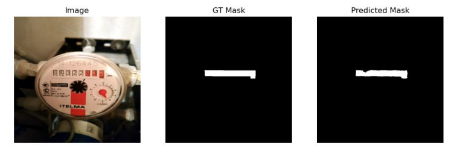

# Water Meters Segmentation

A deep learning project for segmenting water meter displays using U-Net architecture.

**Course**: Fundamentals of Artificial Intelligence

## Example



## Dataset

<a href="https://www.kaggle.com/datasets/tapakah68/yandextoloka-water-meters-dataset?resource=download-directory">Water Meters Dataset</a> (Yandex Toloka)

| Property | Value |
|----------|-------|
| Images | 1244 |
| Masks | 1244 |
| Format | JPG |
| Image type | RGB |
| Mask type | Grayscale |
| Scaled size | 512x512 |

**Data Split:**
- Train: 80%
- Validation: 10%
- Test: 10%

## Model Architecture

U-Net encoder-decoder architecture for binary segmentation.

| Component | Description |
|-----------|-------------|
| Encoder | 4 levels with Conv2d + BatchNorm2d + ReLU + MaxPool2d |
| Bottleneck | Deepest feature representation |
| Decoder | 4 levels with upsampling + skip connections |
| Output | 1 channel binary mask |

| Parameter | Value |
|-----------|-------|
| Input channels | 3 (RGB) |
| Output channels | 1 (binary mask) |
| Input size | 512x512 |
| Total parameters | 243,425 |
| Trainable parameters | 243,425 |

## Results

| Metric | Value |
|--------|-------|
| Dice Coefficient | 0.73 |
| IoU (Intersection over Union) | 0.64 |
| Pixel Accuracy | 99.2% |
| Final Train Loss | ~0.036 |
| Final Val Loss | ~0.035 |

Training converged over 25 epochs with both train and validation loss decreasing consistently, indicating no overfitting.

## Project Structure

```
Water-Meters-Segmentation/
├── README.md
├── Report.pdf
└── WMS/
    ├── src/
    │   ├── dataset.py         # WMSDataset class
    │   ├── model.py           # U-Net model implementation
    │   ├── transforms.py      # Image preprocessing transforms
    │   ├── prepareDataset.py  # Data preparation and splitting
    │   ├── train.py           # Training script
    │   └── predicts.py        # Inference script
    ├── data/
    │   ├── images/            # Original images
    │   ├── masks/             # Segmentation masks
    │   └── collage/           # Sample visualizations
    └── models/
        ├── best.pth           # Best model checkpoint
        └── unet_epoch*.pth    # Epoch checkpoints
```

## Requirements

- Python 3.x
- PyTorch 2.5.1
- Torchvision 0.20.1
- OpenCV (cv2)
- NumPy
- SciPy
- scikit-learn
- matplotlib

## Usage

### 1. Prepare Dataset (optional)
```bash
python WMS/src/prepareDataset.py
```
This script splits the data into train/val/test sets.
It does not need to be run separately, as WMS/src/train.py runs it automatically before training.

### 2. Train Model
```bash
python WMS/src/train.py
```
Trains the U-Net model and saves checkpoints to `models/`.

### 3. Run Inference
```bash
python WMS\src\predicts.py
```
Runs predictions on test images or custom images.

## Authors

- **Wojciech Szewczyk**
- **Rafal Zablotni**

> For more details, see [Report.pdf](Results/Report.pdf) (academic report in Polish).
