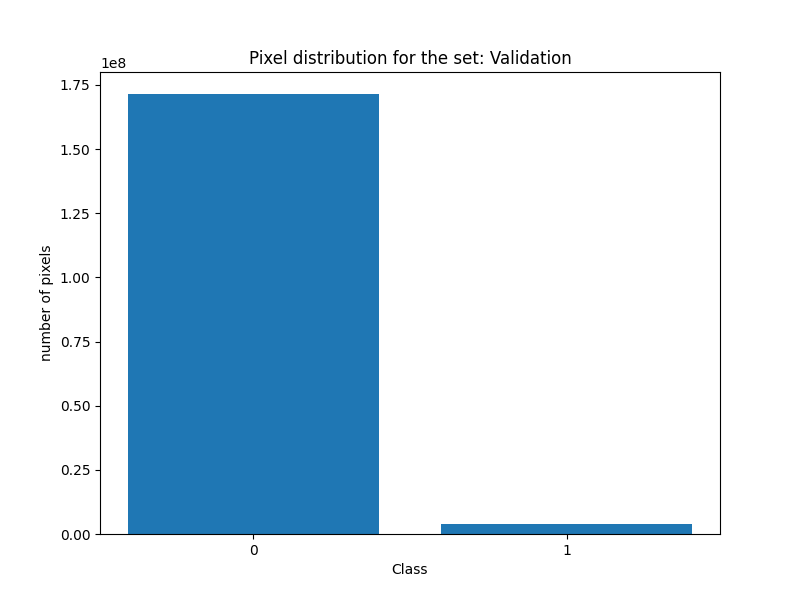
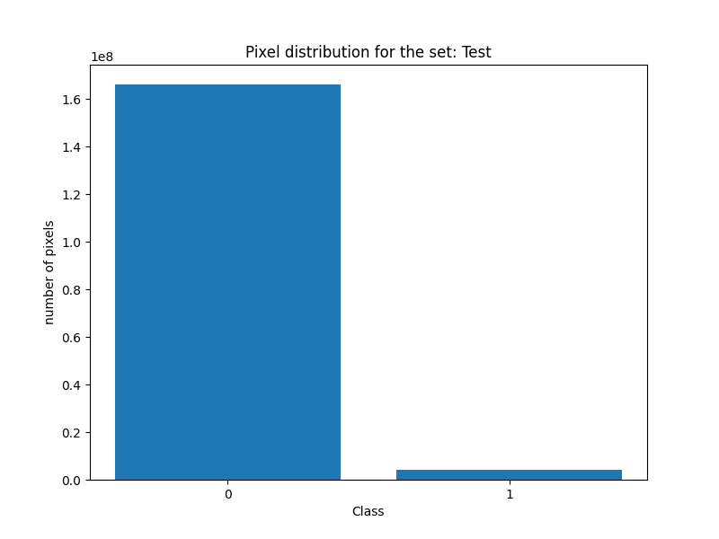
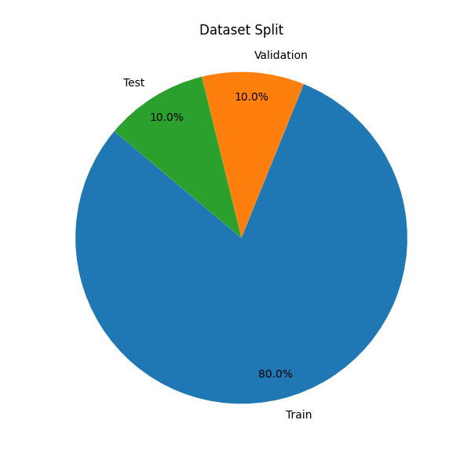
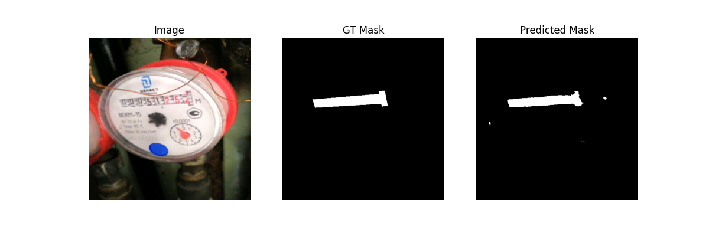
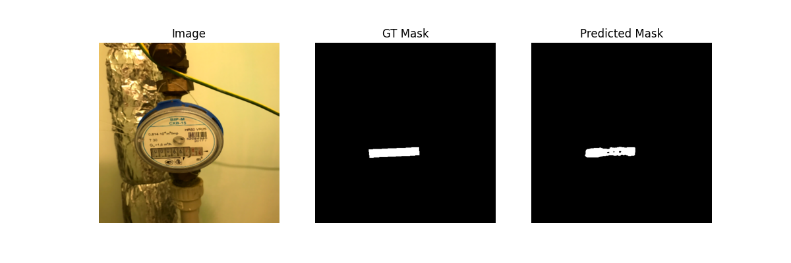
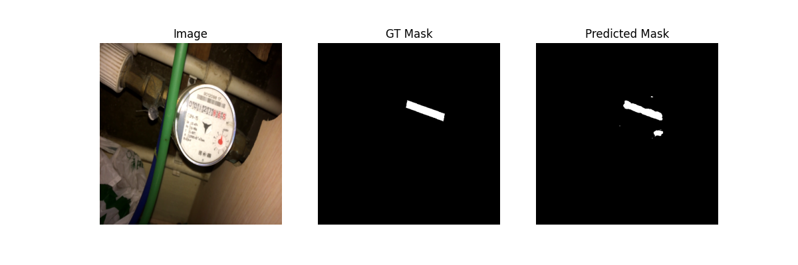
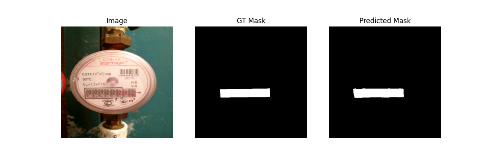

# Water Meters Segmentation - Project Report

## Project Overview

This project implements a U-Net-based semantic segmentation model for water meter detection in images. The goal is to accurately segment and identify water meter displays from various photographs.

**Dataset**: Water Meters
**Total Images**: 1,244 images with corresponding masks
**Image Format**: JPG (RGB)
**Mask Format**: Grayscale
**Input Size**: 512×512 (resized)

## Dataset Preparation

The dataset was split into three sets with a fixed random seed for reproducibility:

- **Training Set**: 995 images (80%)
- **Validation Set**: 124 images (10%)
- **Test Set**: 125 images (10%)

### Data Preprocessing

Images undergo the following preprocessing pipeline:
1. Resize to 512×512 pixels
2. Convert to float32 array in range [0,1]
3. Contrast stretching (using 2nd and 98th percentile)
4. Median filter 3×3 (after scaling to uint8)
5. Convert to PyTorch tensor in CHW format

Masks are loaded as grayscale, binary threshold (0/1 at threshold 127), resized to 512×512 with nearest neighbor interpolation, and converted to float32 tensor with shape [1, H, W].

### Class Distribution

The dataset exhibits significant class imbalance:

**Training Set:**
- Class 0 (background): 1,340,623,799 pixels
- Class 1 (water meter): 31,459,921 pixels

**Validation Set:**
- Class 0: 171,479,679 pixels
- Class 1: 3,984,321 pixels

**Test Set:**
- Class 0: 166,224,835 pixels
- Class 1: 4,038,165 pixels






## Model Architecture

**Architecture**: Modified U-Net
**Total Parameters**: 243,425
**Trainable Parameters**: 243,425

The model consists of:
- **Encoder**: 4 downsampling blocks (16→32→64→128 channels) with Conv2d, BatchNorm2d, ReLU, and MaxPool2d
- **Bottleneck**: Deepest layer with 128 channels at 64×64 resolution
- **Decoder**: 4 upsampling blocks using interpolation and skip connections
- **Output Layer**: Final 1×1 convolution for binary segmentation

### Model Summary

- Input size: 3.00 MB
- Forward/backward pass size: 364.00 MB
- Parameters size: 0.93 MB
- Estimated total size: 367.93 MB

## Training Configuration

- **Framework**: PyTorch 2.6.0+cu118, Torchvision 0.21.0+cpu
- **Device**: GPU (CUDA 11.8)
- **Epochs**: 50 (with early stopping)
- **Loss Function**: Combined loss (Binary Cross-Entropy + Dice Loss)
- **Optimizer**: Adam
- **Early Stopping**: Triggered at epoch 49

## Training Results

The model was trained for 50 epochs with continuous evaluation on validation and test sets:

### Learning Curves

| Epoch | Train Loss | Train Acc | Train Dice | Train IoU | Val Loss | Val Acc | Val Dice | Val IoU | Test Loss | Test Acc | Test Dice | Test IoU |
|-------|------------|-----------|------------|-----------|----------|---------|----------|---------|-----------|----------|-----------|----------|
| 1     | 0.5028     | 0.9301    | 0.2056     | 0.1223    | 0.4609   | 0.9629  | 0.2231   | 0.1384  | 0.4599    | 0.9633   | 0.2193    | 0.1372   |
| 10    | 0.2362     | 0.9840    | 0.5260     | 0.4109    | 0.2314   | 0.9793  | 0.5451   | 0.4155  | 0.2305    | 0.9785   | 0.5462    | 0.4144   |
| 20    | 0.1058     | 0.9888    | 0.6538     | 0.5509    | 0.1113   | 0.9861  | 0.6373   | 0.5248  | 0.1074    | 0.9870   | 0.6484    | 0.5360   |
| 30    | 0.0507     | 0.9911    | 0.7314     | 0.6353    | 0.0574   | 0.9883  | 0.6723   | 0.5720  | 0.0512    | 0.9899   | 0.7012    | 0.6020   |
| 40    | 0.0288     | 0.9931    | 0.7941     | 0.7043    | 0.0429   | 0.9891  | 0.6368   | 0.5485  | 0.0359    | 0.9905   | 0.6617    | 0.5726   |
| 50    | 0.0204     | 0.9942    | 0.8289     | 0.7454    | 0.0401   | 0.9894  | 0.6544   | 0.5626  | 0.0309    | 0.9911   | 0.6783    | 0.5944   |

**Early stopping triggered at epoch 49**

### Observations

1. **Fast Initial Learning**: Rapid decrease in loss and increase in accuracy during the first 5-10 epochs
2. **Stable Convergence**: Metrics stabilized after ~10 epochs with gradual improvement
3. **No Overfitting**: Train, validation, and test losses decreased together, indicating good generalization

## Final Evaluation Metrics

### Test Set Performance

- **Dice Coefficient**: 0.7762
- **IoU (Intersection over Union)**: 0.6842
- **Hausdorff Distance**: 129.2380

### Metric Explanations

**Dice Coefficient** measures the overlap between prediction and ground truth:
```
Dice = (2 × |pred ∩ GT|) / (|pred| + |GT|)
```

**IoU** measures the ratio of intersection to union:
```
IoU = |pred ∩ GT| / |pred ∪ GT|
```

**Hausdorff Distance** measures the maximum distance between boundary points of prediction and ground truth masks.

**Pixel-wise Accuracy** reached ~0.9911, though this is inflated due to class imbalance (~99% background pixels).

## Prediction Examples

The model demonstrates strong segmentation performance on test images from the Water Meters dataset:






## Analysis and Conclusions

### Strengths

1. **Good Segmentation Performance**: Dice score of 0.78 and IoU of 0.68 demonstrate effective water meter detection
2. **Stable Training**: No signs of overfitting; consistent performance across train/val/test sets
3. **Efficient Architecture**: Only 243K parameters, making the model lightweight and fast
4. **Strong Generalization**: Model successfully identifies water meters in various conditions

### Limitations

1. **Class Imbalance**: ~99% background pixels inflate accuracy metrics
2. **Hausdorff Distance**: High value (129.24) indicates occasional boundary prediction errors
3. **Simple Architecture**: Single convolution per block may limit feature extraction capacity

### Future Improvements

1. **Enhanced Architecture**:
   - Implement DoubleConv blocks (two convolutions per stage)
   - Increase base filter count (e.g., 32→64)
   - Add Dropout2d to prevent overfitting

2. **Data Augmentation**:
   - Random rotations, crops, and flips
   - Brightness/contrast adjustments
   - Elastic deformations

3. **Loss Function Optimization**:
   - Weighted loss to address class imbalance
   - Focal loss for hard examples
   - Boundary-aware loss functions

4. **Training Enhancements**:
   - Learning rate scheduling
   - Gradient accumulation for larger effective batch size
   - Mixed precision training for faster convergence

## Technical Environment

- **PyTorch**: 2.6.0+cu118
- **Torchvision**: 0.21.0+cpu
- **CUDA**: 11.8
- **GPU**: Available and utilized

## Project Structure

```
Water-Meters-Segmentation/
├── Data/
│   ├── train/
│   ├── val/
│   └── test/
├── WMS/
│   ├── models/
│   │   ├── best.pth
│   │   └── unet_epoch*.pth
│   └── src/
│       └── train.py
└── Results/
    ├── Pixel_Distribution_*.png
    ├── Example_Prediction_*.png
    └── Terminal.log
```

## Summary

This project successfully implemented a U-Net model for water meter segmentation, achieving a Dice coefficient of 0.7762 and IoU of 0.6842 on the test set. The model demonstrates strong generalization capabilities with stable training dynamics and no signs of overfitting. While the architecture is lightweight and efficient, there is room for improvement through architectural enhancements, data augmentation, and advanced training techniques.

The model serves as a solid baseline for water meter detection tasks and can be further refined for production deployment in automated meter reading systems.
